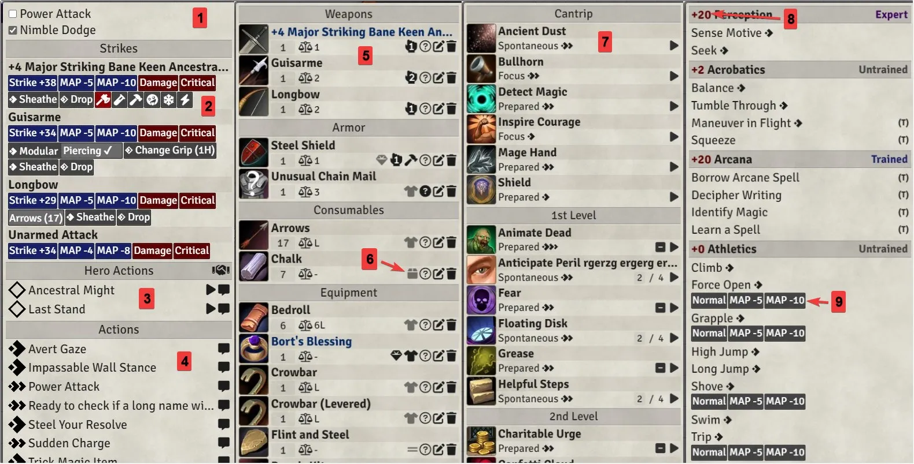
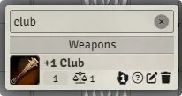
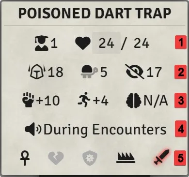
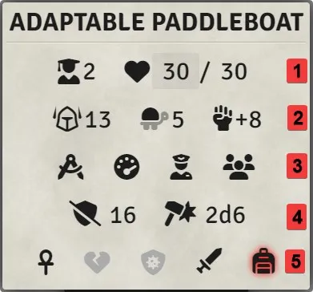
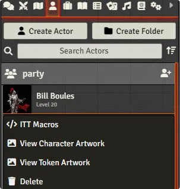

# FoundryVTT PF2e Interactive Token Tooltip

### This module will generate an interactive token tooltip to access all the most used features in PF2e actors sheets.

# Main Tooltip

This tooltip will be shown if you are the owner of the currently hovered over token or if the `Tooltip on Observe` is enabled and you have `observer` permission for this token (there is also the GM setting `Party as Observer` that would affect this showing).

NOTE: if you drag anything over the tooltip, the sidebars or the popup (dragged from inside any of them or from anywhere in the foundry), everything will fade out and you will be able to interact with the tokens beneath them, the only exception for that is when the extras sidebar is opened, so that you can drag & drop macros in it.

1. Hero Points, Alignment and Level

    - you can add/remove hero points by left/right clicking on the pips

2. Temp HP and HP

3. Resolve Points and Stamina

    - this line only appears if the stamina variant rule is enabled in this world
    - you can click on the resolve icon to use the actions `Take a Breather` and `Steel Your Resolve` if available

4. Armor Class and Shield

    - you can use the `Take Cover` action or remove cover by clicking on the wall
    - you can use the `Raise Shield` action by clicking on the shield

5. Fortitude, Reflex and Will

    - this line can be removed
    - you can display their DC instead of their bonus modifier
    - you can display their proficiency rank (U, T, E, M, L)

6. Perception, Stealth and Athletics

    - same as for the saves

7. Dying and Wounded

    - you can add/remove dying/wounded by left/right clicking on the pips
    - clicking on the skull when having dying will roll a `Recovery Check`
    - this line can be removed
    - you can decide to only show this line when the actor has any dying/wounded

8. Speeds, Languages, Senses and IWR

    - clicking on them will reveal their list
    - you can select any speed from within the list that you want to be displayed in the tooltip (this is a per user option)
    - will be greyed out when the actor doesn't have any listed
    - IWR stands for `Immunities`, `Weaknesses` and `Resistances`

9. Actions, Equipment, Spells, Skills and Extras

    - those will open their respective sidebar containing an abundance of information about the actor
    - a first screening is done to see if any should be greyed out

10. Distance to Selected/Target

    - this uses the pf2e system distance calculation with alternate diagonals and also the height difference between the tokens
    - if you have a token selected and it is not the one currently hovered over, then the distance between them will be displayed
    - if no token is selected or is the currently hovered over, then your target will be used instead if any
    - a different icon is shown to make it clear if the distance is calculated with a selected or target token
    - there needs to be only 1 selected or target token for it to work
    - this can be disabled or set to owned/observed tooltip only

11. Health Status
    - This gives a textual representation of the current state of wellness of the hovered over token
    - can be disabled for owned/observed tokens

# Actions, Equipment, Spells and Skills

1. Roll Option toggles

2. Strikes

    - just like in the actor's sheet, you can use the `shift` and `ctrl` keys to open/not open the modifiers window and roll blind
    - you can click on a `Character` strike name to see its description
    - `NPC` strikes will instead display their tags below the name which are clickable to see their desription
    - you can hover over the damage and critical buttons to see their formula.

3. Hero Action

    - those will only show up if you have the `PF2e Hero Actions` module active
    - you can find all the functionalities of the module itself

4. Actions

    - list of the actors action
    - they can be either split by types or into a single group sorted by type/name
    - recognized skill action that are used in the skills sidebar will be filtered out of this list to shorten the list (the ones in the skill sidebar are actually usable anyways)

5. Equipment
    - you can click on the name of an item to see its description
    - you can click on an item's image to send its description to chat
    - you can drag an item out of the equipment sidebar which will have the same effect as if you were to drag an item out of the actor's sheet (e.g. giving it to another actor)
    - items are split by categories (weapons, armors, consumables, equipment, treasure and containers)
    - all items will be in their respective category regardless of the fact that they me be inside a container
6. Stowed Items

    - if an item is inside a container, it will have the cardbox icon, hovering over the icon will display the name of the container

7. Spells

    - spells are split into level tables instead of by spellcasting entry
    - focus and ritual spells have their own table at the bottom
    - if the actor has focus cantrips but no focus spells (e.g. psychic class), the focus pips will instead be displayed in the cantrip table
    - spell/spellcasting resources are displayed inside each spell row for convenience and can be interacted with
    - you can click the name of a spell to see its description
    - you can click the spell's image to send its description to chat

8. Skills

    - clicking on a skill's bonus modifier will make a roll
    - a list of skill actions have been added per skill and can be clicked on to make a skill action roll
    - right clicking on a skill action will allow you to use a variant skill for the action (e.g. making a `seek` roll using `arcana` instead of `perception`)
    - just like in the actor's sheet, you can use the `shift` and `ctrl` keys to open/not open the modifiers window and roll blind respectively
    - skill actions that have the secret trait will be rolled blind automatically
    - skill actions that require the actor to be trained to be used will be marked with a `(T)` you can also decide to not show those if the actor isn't trained in the associated skill

9. Skill Action Variants
    - some skill actions have variants, in that case, the action itself isn't clickable, you instead have to click on one of its variant

# Extras

1. Initiative

2. Utilities

    - `Daily Preparation` will only appear if the `PF2e Dailies` is active

3. Actions

    - those are custom made actions that are special enough to not be in the skills sidebar

4. Drop Macros Here

    - if you drop a macro in the extras sidebar, it will be added for this actor (this is a per user feature)
    - you can actually drop macros anywhere inside the sidebar and not just in the little box

5. Macros
    - you can execute, edit and delete added macros
    - macros will be executed with the `Actor` and `Token` the tooltip is related to as arguments

# Filter Field

A filter field (hidden by default) is available at the top of each sidebar, you can make it always be displayed with a setting or use a keybind (`Ctrl + F` by default).

-   actions will not filter the strikes, toggles or `Hero Actions`
-   extras will only filter the macros

# Small Tooltip

An alternate version of the tooltip that only displays the distance and the health status of the token actor.

There are multiple ways/reasons for this version of the tooltip to appear instead of the regular one:

-   one being if you are not owner or have observer permission over the token depending on the settings.

-   Another one is if a GM select the `Hold to show fully` option for the `Use Hold Key` setting and not holding the key

# Hazard Tooltip

1. Level and HP

2. Armor Class, Hardness and Stealth DC

    - if more Stealth DC details exist in the sheet, the icon will be dark and clickable

3. Saves

    - respect the regular tooltip settings

4. Emits Sound

5. Immunities, Weaknesses, Resistances, Hazard and Actions
    - actions only appears if containing anything
    - actions use the regular tooltip sidebar
    - the hazard sidebar contains all the remaining details available in the sheet as well as the initiative roll for complex hazards

# Vehicle Tooltip

1. Level and HP

2. Amor Class, Hardness and Fortitude

    - fortitude respects the regular tooltip settings except `Disabled`

3. Piloting Check, Speed, Crew and Passengers

4. Collision DC and Collision Damage

    - clicking on collision DC will send a reflex check link to chat
    - clicking on collision damage will roll the damage

5. Immunities, Weaknesses, Resistances, Actions and Equipment
    - actions and equipment respectively appear when containing something
    - actions and equipment use the regular tooltip sidebars

# Actor ContextMenu

A new contextmenu option has been added for actors to add macros on the actor directly, this is very convenient (but not limited to) for unlinked actors to setup their macros once, when a new token is dragged onto the board, all the macros will be there instead of having to do it every time or having to copy/paste tokens all around.

# World Settings

## Health Status

The GM can add multiple states that will be used to textually represente the wellness of a token actor

The max HP (plus stamina) will be divided by the number of states and the appropriate one will be displayed to the users

Leaving this field empty will disable the feature for everybody

## Party as Observer

When enabled by the GM, the module will consider any token actor in the `Party` alliance to be observable, this is useful if you don't want your players to share visions (which the regular `observer` forces) but still want them to be able to look at other player's tooltip

# Client Settings

## Enabled

This enable/disable the module on this client.

## Tooltip Position

Let you select your preferred position for the tooltip to appear around the hovered token. If the tooltip cannot fit there, it will first try to appear on the opposite side, otherwise, in one of the remaining two.

## Small Tooltip Position

Same as above, it lets you select your preferred position for the small tooltip.

## Tooltip Delay

The delay in milliseconds before the tooltip show on screen, this is bypassed when holding the `Hold to Display` keybind

## Scale by Font

This let you upscale or downscale the tooltip and all its attached sidebars/popup based on the font size, there are still a few little things that will no scale like foundry core tooltips but globally, this setting should be usable if needed.

## Use Hold Keybind

This setting will show different options and description to GMs and players.

For GMs, it offer the option to only show tooltips when the key is held or instead show the small tooltip until the key is held.

For players, it offers the option to only show tooltips when the key is held or to show owned/observed token tooltips when the key is held and still see small tooltips without.

NOTE: you don't have to hold the key before hovering over a token, hitting the key during an hover will also work and will turn a small token into a regular token when appropriate.

## Tooltip on Observe

When enabled and hovering over a token the player has the `observer` permission (or in party if the option is enabled), the module will generate an uneditable version of the full tooltip.

This does nothing to the GM because they have `owner` and therefore `obersver` permission over everything.

## Health Status on Owned

When enabled, the health status will also be displayed on the regular tooltip instead of just on the small one.

## Disable Chat Card Hover

When hovering over a chat card that has been generated by a token actor, foundry will trigger the `hoverToken` event which this module is reliant on to display the tooltips, because of that, navigating the chat can become annoying and ddisplay tooltips constantly, this setting disable that behavior.

## Show Saves

Select if you want to see the saves DCs or bonus modifiers or remove the entire line altogether

## Perception, Stealth, Ahtletics

Does the same as above

## Display Ranks

You can decide to see the ranks of the saves and perception lines for convenience, because of the lack of real estate in those parts, the rank will only be composed of the first letter and in superscript.

## Show Death Line

Lets you decide if you want to see the dying/wounded line all the time or only when the actor actually as any, you can also hide the line all the time.

## Force Highest Speed

If no speed has been manually selected, this setting will always display the highest speed found on the actor even if the land speed isn't 0.

## Disable Icon Tooltips

When hovering over any of the main tooltip icons, its name will be shown, this setting prevent it from happening (after a while, you won't need to be reminded of what they do).

## Distance to Token

Show the distance on all tokens or owned/observed tokens only, can also be disabled.

## Distance Unit

Lets you indicate what unit should be used for the distance, what is its ratio compared to a foot and how many decimals should be displayed. All those are set in a single field separated by commas

> 0.3, m, 2

This would convert feet into meters and display 2 decimals

## Sidebar Max Height

Allows you to set a maximum height for the sidebars, this accept any css value that would be valid for a height property (e.g. `300px`, `50%`).

## Always Show Filter

When enabled, the filter field will always be displayed at the top of sidebars instead of when using the 'Show Filter' keybind, the keybind still scroll to the top and gives focus to the field.

## Sidebar Scrollbar

When disabled, the scrollbar of the sidebars will be hidden, i am looking at you firefox users and your ginormous scrollbars.

## Hazard Max Width

The hazard tooltip has a single sidebar that can contain a lot of description text (as opposed to all other sidebars which contain none), for that reason, you can decide to have a extra large sidebar when it comes to hazard.

## Two Columns X

Those settings will split the different sidebars in two, the result is not always desirable (especially the actions sidebar).

## Actions Sorting

Will sort the actions either split by categories or in a single table sorted by name or type.

## Strikes & Damages System Colors

Will reproduce the system coloring of the strikes attack & damage buttons, this make them more distinguishable.

## Sort Spells by Type

When enabled, it will sort the spells in a single table by type before sorting them by name.

## Show Spell Tradition

When enabled, the first letter of the spell tradition (arcane, occult, divine, primal) will be displayed in the spell row.

## Hide Untrained Skill Actions

When enabled, all skill action that require the character to be trained will be hidden from the sidebar if the actor is in fact untrained

This does nothing on NPCs

# CHANGELOG

You can see the changelog [HERE](./CHANGELOG.md)
